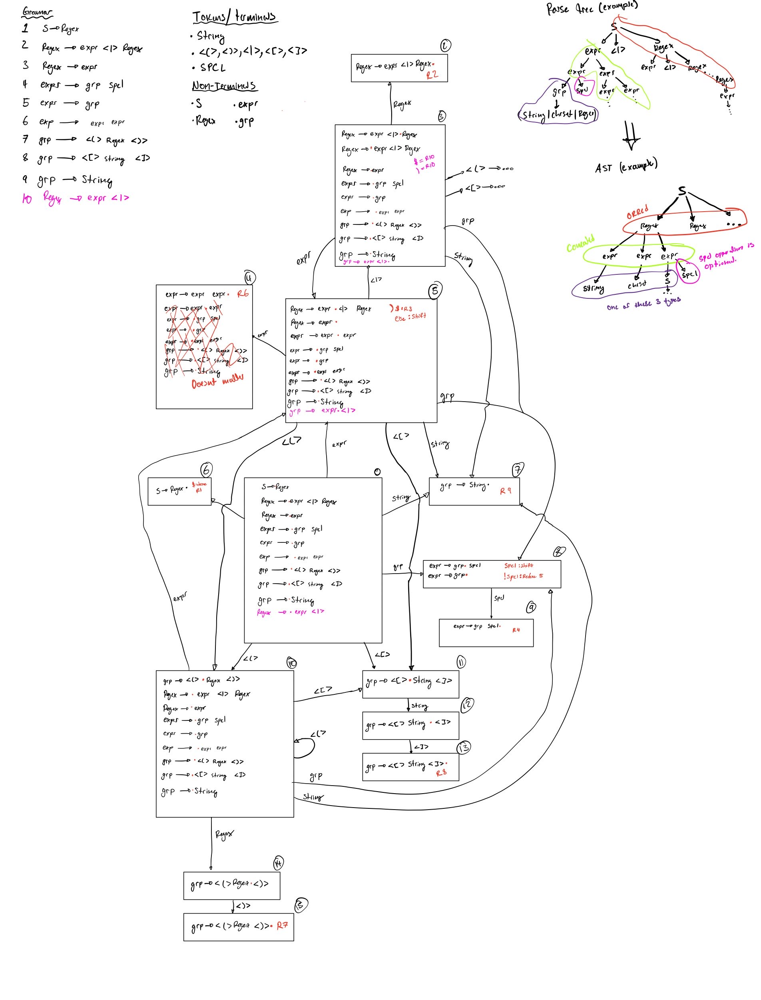

# Mini-regex

[github repo](https://github.com/yiannis-cunning/regex). [ascii table](https://www.asciitable.com/).

For use on ASCII, NULL terminated C strings. Supported special characters:
 
| Character | Meaning|
| --------- | ------ |
| \|         | OR two possible matches |
| *         | Repeat the previous group 0 or more times |
| +         | Repeat the previous group 1 or more times |
| ?         | Match to previous group or skip |
| ( )       | Start grouping/end grouping |
| []        | Match to a caracter set |

#### Not supported right now:
* Macros of common character sets (ie: \w \d ... ext)
* Repeat grouping N times operation {N}
* Inverse of character set [^x]
* Match to start or end of string ($ / ^)

#### Character sets:
Character sets will take the inside of the brackets as a literal. If there is a dash (-) then the range between the two ASCII codes will be taken.

## Usage
```c++
    #include "miniregex.h"
    miniregex_t x;
    int ret = make_regex("aa|b+|[ac]*", &x);
    if(ret != 0){
        //...
    }

    if(match_regex(x, "...")){
        printf("String matches\n");
    } else{
        printf("String does not match\n");
    }

```
Build test
```bash
meson setup build
meson compile -C build
```

## Implementation

### 1. Tokenization
The first stage will be to convert the input regular expresion into a list of tokens. Their type will be one of the following:
* STRING - string of consecutive normal characters
* SPCL - special characters that operate on a group - * / + / ?
* CCL/CCR/SQR/SQL - left and right for both types of bracket
* NULL - end of the string


### 2. Creating the Parse Tree
Next the regex string will be parsed with a LR(1) parser.

The below grammar was used for parsing. The parse table was generated using the state diagram shown below.
* S -> Regex
* Regex -> expr <|> Regex
* Regex -> expr <|> Regex
* Regex -> expr
* expr -> grp spcl
* expr -> expr expr
* grp -> <(> Regex <)>
* grp -> <[> string <]>
* grp -> string


### 3. Convert to AST
Using the parse tree, a abstract syntax tree can be made to put the structure of the regext in a more usable form. This is done after the parse tree is completley made.

### 4. NFA creation and DFT conversion
Next a nondeterministic finite automaton (NFA) can be created out of the different levels of the AST. This can then be converted directly to a deterministic finite automaton (DFA) by merging states of the NFA repeatedly.


### 6. Regex traversal
In order to test a given input string, the DFA can be traversed by progresing to the next state if there is a edge that the input character matches too and if it ends on a finish state.

